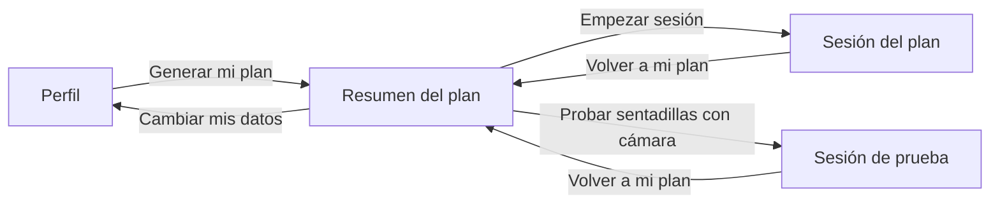
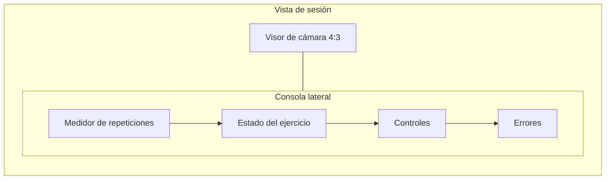
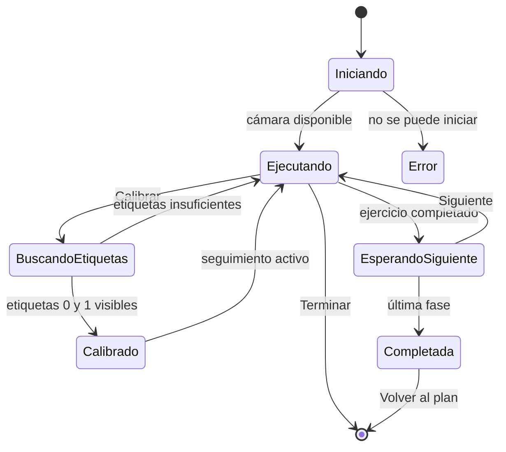
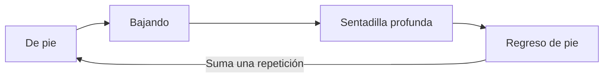

# Sistema de diseño del frontend

Este documento define el diseño visual, la interacción y los criterios de accesibilidad del frontend de PattyDoc. Describe el comportamiento implementado y funciona como referencia para mantener una experiencia coherente al crear o modificar pantallas.

> **Fuente de verdad:** los tokens y estilos ejecutables están en `frontend/src/styles.css`. Si el código y este documento difieren, se debe corregir la diferencia en el mismo cambio.

## 1. Propósito del producto

PattyDoc genera y acompaña planes de ejercicio para personas con discapacidad visual. El frontend debe permitir que una persona complete el flujo principal con baja visión o sin depender de la imagen de la cámara.

La dirección de diseño se denomina **la consola audible**: una interfaz operativa, clara y de alto contraste que combina información visual estable con instrucciones habladas. La cámara sirve para el seguimiento del ejercicio, pero la voz, los estados textuales y los controles siguen siendo parte esencial de la experiencia.

### Audiencia principal

- Personas con baja visión, ceguera total u otras condiciones visuales.
- Personas que necesitan instrucciones breves mientras hacen ejercicio.
- Acompañantes o supervisores que consultan el estado visual de la sesión.
- Desarrolladores que prueban el seguimiento con AprilTags.

### Principios

1. **La información precede a la decoración.** Cada elemento debe comunicar estado, progreso o una acción.
2. **La voz tiene equivalente visual.** Las instrucciones importantes aparecen también en pantalla.
3. **El color nunca actúa solo.** Estado, texto y posición refuerzan su significado.
4. **Los controles son grandes y predecibles.** Las acciones mantienen nombre, orden, color y atajo.
5. **La cámara no se recorta.** El usuario debe poder comprobar el encuadre y las etiquetas completas.
6. **El avance es explícito.** Ningún ejercicio manual debe saltarse automáticamente.
7. **La composición permanece estable.** Los cambios de estado no deben desplazar los controles principales.

## 2. Arquitectura de experiencia

El frontend es una aplicación de una sola página con tres vistas principales.

No se utiliza un menú de navegación porque el flujo es corto, lineal y orientado a una tarea. La jerarquía global es: cabecera de marca, contenido principal, acción contextual y mensajes de estado o error.

## 3. Fundamentos visuales

### Paleta

| Token | Valor | Uso |
|---|---:|---|
| `--bg` | `#f5f7fa` | Fondo general de la aplicación |
| `--ink` | `#0d1b2a` | Texto principal, cabecera y fondos de alto contraste |
| `--panel` | `#ffffff` | Formularios, listas y paneles informativos |
| `--signal` | `#ffb000` | Acción primaria, foco y progreso de profundidad |
| `--signal-ink` | `#0d1b2a` | Texto sobre el color de señal |
| `--ok` | `#1e7a46` | Éxito, postura correcta y acciones de avance |
| `--ok-soft` | `#e6f2ea` | Fondo de mensajes correctos |
| `--alert` | `#c63d3d` | Error, postura incorrecta y acción de terminar |
| `--alert-soft` | `#fbeaea` | Fondo de mensajes de error |
| `--muted` | `#5a6b7d` | Texto secundario y estado sin detección |
| `--line` | `#dde4ec` | Bordes, separadores y pista del medidor |

Colores auxiliares: `#fff4d6` y `#8a5b00` para advertencias, `#eaf1f8` para información y negro para el fondo del visor.

### Semántica del color

- **Ámbar:** atención y acción principal; no representa error.
- **Verde:** condición correcta, calibración lista o avance permitido.
- **Rojo:** error, riesgo postural o finalización intencional.
- **Gris azulado:** información secundaria, control deshabilitado o ausencia de detección.
- **Azul marino:** estructura, texto principal y contraste de marca.

El color nunca es el único indicador. No deben añadirse colores arbitrarios dentro de componentes: todo color recurrente debe convertirse en token y conservar una función semántica estable.

### Tipografía

| Rol | Familia | Pesos | Aplicación |
|---|---|---|---|
| Display | `Archivo` | 500, 700, 900 | Marca, títulos y números de progreso |
| Cuerpo | `IBM Plex Sans` | 400, 500, 700 | Formularios, botones y descripciones |
| Técnica | `JetBrains Mono` | 500, 700 | Etiquetas, estados, atajos y metadatos |

Las fuentes se cargan desde Google Fonts en `frontend/index.html` y tienen alternativas del sistema. El cuerpo conserva una altura de línea de `1.5`.

Reglas tipográficas:

- Los títulos de página usan `Archivo` con peso 900.
- El texto operativo usa frases cortas y vocabulario directo.
- Las etiquetas técnicas pueden usar mayúsculas, pero no párrafos completos.
- Los atajos de teclado usan la fuente monoespaciada.
- Solo el título principal usa `clamp()`, entre límites definidos.
- No se reduce texto para hacerlo caber; el contenedor debe crecer o permitir salto de línea.

### Forma, bordes y profundidad

| Elemento | Especificación |
|---|---|
| Radio principal | `14px`, token `--radius` |
| Radio compacto | `8px`, token `--radius-sm` |
| Borde estándar | `1px solid var(--line)` |
| Borde de campos | `1.5px solid var(--line)` |
| Borde de botones | `2px`, transparente o visible según variante |
| Foco | Contorno ámbar de `3px` con separación de `2px` |
| Altura mínima de botón | `4rem` |
| Altura mínima de campo | `3rem` |

Los botones primarios, de avance y de terminación usan una sombra inferior sólida de `6px`. Las secciones no se convierten en tarjetas flotantes; los paneles se reservan para agrupaciones funcionales.

### Espaciado

La escala usa principalmente múltiplos de `0.25rem` y `0.5rem`.

| Escala | Valor | Uso típico |
|---|---:|---|
| XS | `0.25rem` | Separación interna de estado |
| S | `0.5rem` | Celdas y metadatos |
| M | `1rem` | Campos, mensajes y separación básica |
| L | `1.5rem` | Grupos de formulario y botones |
| XL | `2rem` | Columnas y márgenes de sección |
| XXL | `3rem` | Respiración superior del contenido |

## 4. Estructura de las vistas

### Perfil

- Contenedor máximo de `860px`.
- Título introductorio seguido de una explicación breve.
- Campos agrupados semánticamente con `fieldset` y `legend`.
- Cuadrícula adaptable con columnas mínimas de `210px`.
- Botón `Generar mi plan` de ancho completo.
- Error antes de la acción principal con `role="alert"`.

Los grupos avanzan desde los datos personales hacia las preferencias: ficha, visión y salud, entorno y forma de guía.

### Resumen del plan

- Contenedor máximo de `620px` para facilitar la lectura.
- Tres fases ordenadas: calentamiento, entrenamiento y enfriamiento.
- Cada fase muestra orden, categoría y ejercicio.
- Acciones en este orden: iniciar el plan, probar sentadillas, volver al perfil.
- La prueba sustituye solo el entrenamiento por la sentadilla rastreada; no modifica el plan original.

### Sesión

En escritorio se divide entre un visor flexible y una consola lateral de `400px`.

El visor y la consola son hermanos. En pantallas angostas se apilan manteniendo primero la cámara y después la información operativa.

## 5. Componentes

### Cabecera de marca

- Fondo azul marino y texto blanco.
- Nombre en `Archivo`, peso 900 y espaciado amplio.
- Acento de marca en ámbar.
- Frase de marca alineada a la derecha y oculta por debajo de `560px`.
- Altura contenida para no competir con la tarea principal.

### Hero

- Título entre `2rem` y `3.4rem`.
- Énfasis del perfil subrayado con una franja ámbar.
- Descripción con máximo de `46ch`.
- Kicker técnico verde en el resumen para indicar que el plan está listo.

### Campos

- Etiquetas siempre visibles; el placeholder no reemplaza una etiqueta.
- Campos numéricos con mínimo, máximo y paso.
- Opciones categóricas en `select` nativo.
- Foco con borde ámbar y contorno global.
- Valores iniciales que permiten probar el flujo completo.

### Lista del plan

- Cada fase es una unidad con borde ligero y fondo blanco.
- El orden ocupa un bloque ámbar estable de `3rem`.
- La categoría usa texto técnico pequeño y el ejercicio texto de cuerpo destacado.
- La estructura semántica es una lista ordenada.

### Botones

| Variante | Clase | Función |
|---|---|---|
| Primaria | `.btn--primary` | Crear, iniciar o calibrar |
| Avance | `.btn--ok` | Probar seguimiento o pasar al siguiente ejercicio |
| Peligro | `.btn--danger` | Terminar la sesión |
| Secundaria | `.btn--ghost` | Volver o cambiar datos |

Estados obligatorios:

- **Reposo:** color y profundidad completos.
- **Hover:** aclarado moderado sin cambio de tamaño.
- **Activo:** desplazamiento vertical de `1px`.
- **Foco:** contorno ámbar visible.
- **Deshabilitado:** opacidad `0.45`, cursor no interactivo y atributo `disabled`.
- **Carga:** texto descriptivo, como `Generando...` o `Buscando etiquetas...`.

Los controles de sesión incluyen los atajos `C`, `N` y `Q` como información secundaria. La acción debe entenderse sin el atajo.

### Visor de cámara

- Relación de aspecto `4 / 3`.
- Fondo negro para distinguir el área no cubierta por la señal.
- Imagen a todo el espacio con `object-fit: contain`.
- Nunca se usa `cover`, porque recortaría el cuerpo o las etiquetas.
- Texto alternativo que describe la transmisión y los marcadores.
- Mensaje `Activando cámara...` durante el inicio.
- Capa completa de resultado al terminar la sesión.

El encuadre esperado permite ver torso, hombros y etiquetas AprilTag 0 y 1. La interfaz debe mostrar el fotograma completo para facilitar ese ajuste.

### Medidor circular

El medidor mide `200px` por `200px` y tiene tres capas:

1. Pista gris para el recorrido total.
2. Arco ámbar para la profundidad instantánea.
3. Arco interior para las repeticiones completadas.

El progreso interior es gris cuando no hay etiquetas visibles, verde con postura correcta y rojo cuando se requiere corrección. La etiqueta central cambia entre `SIGUE BAJANDO`, `VUELVE DE PIE` y `REPETICIONES`.

El medidor es un refuerzo visual marcado como decorativo para tecnologías de asistencia. La información equivalente está en el panel de estado y en la voz.

### Panel de estado

Usa `aria-live="polite"` y comunica fase, ejercicio, movimiento, etiquetas detectadas, calibración, corrección e instrucción de avance.

| Nivel | Etiqueta | Presentación |
|---|---|---|
| `ok` | En orden | Verde sobre fondo verde suave |
| `warning` | Ajusta | Ámbar oscuro sobre fondo amarillo suave |
| `error` | Atención | Rojo sobre fondo rojo suave |
| `info` | Nota | Azul marino sobre fondo azul claro |

### Controles de sesión

El orden es estable:

1. `Calibrar postura`: solo en un ejercicio rastreado antes de calibrar.
2. `Siguiente`: solo cuando el estado es `waiting_next`.
3. `Terminar`: durante la ejecución o la espera de avance.

En ejercicios manuales, el primer botón dice `No requiere calibración` y permanece deshabilitado. La ausencia de seguimiento no debe parecer un fallo.

## 6. Estados e interacción

### Contrato de avance

- Un ejercicio rastreado llega a `waiting_next` al cumplir el objetivo.
- Un ejercicio manual permanece activo hasta la confirmación de la persona.
- `Siguiente` nunca se habilita por un temporizador visual.
- La sesión se completa después de terminar o confirmar la última fase.

### Contrato de calibración

Calibrar no configura las etiquetas ni cambia sus identificadores. Captura la postura inicial usando las AprilTags 0 y 1 visibles en los hombros.

1. La persona adopta la postura de pie.
2. Presiona `Calibrar postura` o la tecla `C`.
3. La interfaz muestra `Buscando etiquetas...`.
4. El backend espera a ver ambas etiquetas.
5. El estado pasa a `Lista` al registrar la referencia.

Si faltan etiquetas, la calibración sigue pendiente y el panel indica cuáles fueron detectadas.

### Conteo de sentadillas

Una repetición requiere el ciclo completo:

La barra de profundidad puede completarse sin sumar una repetición si la persona todavía no ha regresado a la postura de pie.

## 7. Voz

La síntesis usa Web Speech API mediante `window.speechSynthesis`:

- Idioma solicitado: `es-ES`.
- Velocidad predeterminada: `1`.
- Primera voz instalada cuyo idioma comience por `es`.
- Un mensaje nuevo cancela el anterior para evitar superposición.
- La salida se detiene al desmontar o terminar la sesión.

Se anuncian la generación y el resumen del plan, el inicio, los cambios de fase, correcciones nuevas, espera de avance, finalización y errores. Mientras el navegador habla, el medidor muestra un anillo animado; este efecto es complementario.

## 8. Accesibilidad

### Requisitos obligatorios

- Documento con `lang="es"`.
- Navegación completa por teclado.
- Foco visible con contraste alto.
- Botones reales para todas las acciones.
- Campos asociados a etiquetas persistentes.
- Estructura con `fieldset`, `legend`, listas y encabezados.
- Errores con `role="alert"`.
- Estado dinámico con `aria-live="polite"`.
- Texto alternativo para la cámara.
- Controles de al menos `4rem` de alto.
- Información crítica independiente del color, animación o video.
- Respeto de `prefers-reduced-motion`.

### Atajos

| Tecla | Acción | Disponibilidad |
|---|---|---|
| `C` | Calibrar postura | Ejercicio rastreado sin calibrar |
| `N` | Siguiente | Ejercicio terminado |
| `Q` | Terminar | Sesión activa |

Los atajos complementan los botones; nunca los sustituyen.

### Movimiento reducido

Con `prefers-reduced-motion: reduce` se detiene la animación repetitiva del anillo de voz, se eliminan transiciones de botones y se conserva una indicación estática.

### Validación recomendada

- Recorrido completo por teclado.
- Zoom del navegador al 200 %.
- Vista de `360px` de ancho.
- Escritorio de al menos `1280px`.
- Preferencia de movimiento reducido.
- Cámara disponible y ausente.
- Ejercicio rastreado y manual.
- Lectura del flujo sin observar el video.

## 9. Diseño responsive

| Rango | Comportamiento |
|---|---|
| Más de `960px` | Sesión en dos columnas: visor flexible y consola de `400px` |
| Hasta `960px` | Sesión en una columna y controles en tres columnas |
| Hasta `560px` | Controles apilados, frase de marca oculta y padding reducido |

El visor conserva `4:3`, los campos pasan a una columna al no caber sus `210px` mínimos y los botones permiten salto de línea. Los cambios de estado no deben alterar la estructura.

## 10. Contenido y lenguaje

- Usar español claro, segunda persona y verbos de acción.
- Nombrar el resultado: `Calibrar postura`, no solo `Calibrar`.
- Explicar el siguiente movimiento y no solo el estado interno.
- Evitar abreviaturas técnicas en mensajes para el usuario.
- Reservar identificadores AprilTag y estados internos para diagnóstico.
- No usar iconos decorativos, emojis ni símbolos poco familiares para reemplazar texto.
- Mantener consistencia entre texto visible y voz.
- Usar puntos suspensivos solo durante una operación en curso.

## 11. Archivos responsables

| Archivo | Responsabilidad |
|---|---|
| `frontend/src/styles.css` | Tokens, layout, componentes, responsive y movimiento reducido |
| `frontend/src/App.jsx` | Flujo de vistas y cabecera |
| `frontend/src/components/ProfileForm.jsx` | Perfil y errores de generación |
| `frontend/src/components/PlanSummary.jsx` | Plan y rutas de inicio |
| `frontend/src/components/SessionView.jsx` | Ciclo de vida, voz, teclado y composición |
| `frontend/src/components/CameraView.jsx` | Transmisión y texto alternativo |
| `frontend/src/components/Gauge.jsx` | Progreso, profundidad y guía |
| `frontend/src/components/StatusPanel.jsx` | Estado accesible y diagnóstico |
| `frontend/src/components/ControlButtons.jsx` | Disponibilidad, nombres y orden de acciones |
| `frontend/src/voice.js` | Selección, reproducción y cancelación de voz |
| `frontend/index.html` | Idioma, metadatos y fuentes |

## 12. Extensión del diseño

Antes de añadir un componente:

1. Confirmar que resuelve una tarea real.
2. Reutilizar tokens, tipografía y variantes existentes.
3. Definir reposo, carga, éxito, error y deshabilitado.
4. Definir la experiencia por teclado y lector de pantalla.
5. Comprobar `360px`, `960px` y escritorio amplio.
6. Añadir voz solo si el mensaje requiere atención durante el ejercicio.
7. Evitar tarjetas anidadas, controles decorativos e información redundante.
8. Actualizar este documento si cambia un contrato.

### Criterio de terminado

Un cambio del frontend está listo cuando funciona con ratón y teclado; no presenta solapamientos, texto recortado ni saltos inesperados; muestra la cámara completa; explica los estados deshabilitados; alinea voz y texto; cubre carga y error; responde en móvil y escritorio; completa el build de Vite; y mantiene actualizada la documentación.

## 13. Límites actuales

- El seguimiento automático está implementado para sentadillas asistidas con silla o barra.
- Los demás ejercicios usan guía manual y avance explícito.
- La voz depende de Web Speech API y de las voces instaladas.
- No existe selector de voz, volumen o velocidad.
- El perfil y el plan no persisten después de recargar la página.
- El medidor visual no sustituye el estado accesible ni la voz.

Estas limitaciones no deben ocultarse mediante temporizadores, avances automáticos o estados ambiguos.
