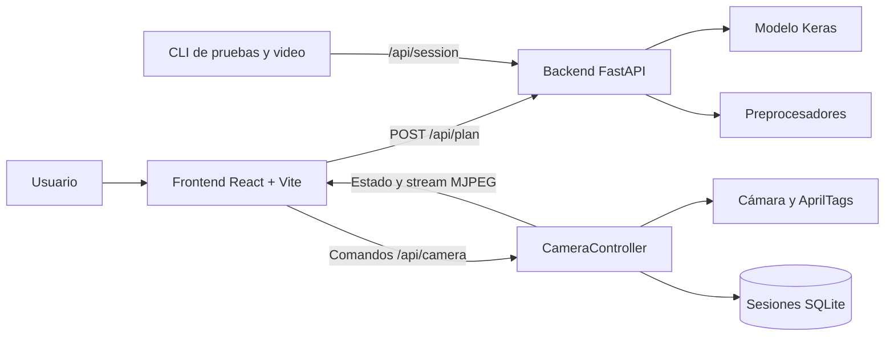

# Plan de Acondicionamiento Físico Personalizado con IA

Sistema de **inteligencia artificial** que genera planes de ejercicio físico personalizados para **personas con discapacidad visual**. El proyecto integra un **modelo de redes neuronales (Keras/TensorFlow)**, un **backend API (FastAPI)** y un **gemelo digital operativo en MVP** (detección de AprilTags por cámara) que supervisa la ejecución del ejercicio en tiempo real y corrige al usuario por voz.

---

## Objetivo del proyecto

Las personas con discapacidad visual suelen tener acceso limitado a programas de actividad física seguros y adaptados a su condición. Este sistema resuelve el problema con:

1. **Personalización:** un modelo de IA recomienda 3 ejercicios (calentamiento, entrenamiento, enfriamiento) según el perfil del usuario.
2. **Accesibilidad:** las correcciones y el plan se entregan por voz (texto a voz), pensado para usuarios sin visión.
3. **Supervisión automática (MVP):** una cámara detecta tags colocados en el cuerpo (hombros) y un "gemelo digital" evalúa si el ejercicio se ejecuta correctamente, contando repeticiones y corrigiendo la postura.

---

## Arquitectura general



### Componentes

| Componente | Tecnología | Estado |
|-------------|------------|--------|
| **Backend API** | FastAPI + Uvicorn |  Implementado |
| **Modelo de IA** | Keras 3 / TensorFlow 2 |  Entrenado (`modelo5.keras`) |
| **Preprocesamiento** | scikit-learn (LabelEncoder, StandardScaler) |  Implementado |
| **Sesiones de ejercicio** | FastAPI + SQLite |  Implementado |
| **Motor de corrección** | Reglas por plantilla (`exercise_templates.json`) |  Implementado (sentadilla) |
| **Gemelo digital (detector de tags)** | OpenCV + pupil_apriltags + gTTS |  MVP (sentadilla) |
| **Frontend Web** | React + Vite (separado de la API) |  Implementado y validado |
| **Calibración AprilTags** | IDs 0 y 1, pose inicial y diagnóstico visible |  Implementado |
| **Conteo de sentadillas** | Ciclo de pie → profundidad → de pie |  Implementado y validado |
| **Ejercicios sin plantilla** | Ejecución manual con avance explícito |  Implementado |

---

## Estructura del repositorio

```
proyectoPattyDoc/
├── app/                          # Backend FastAPI
│   ├── main.py                   # Instancia de la app, CORS, lifespan
│   ├── core/config.py            # Rutas y configuración global
│   ├── models/
│   │   ├── preprocessing.py      # Preprocesamiento del dataset
│   │   ├── neural.py             # Arquitectura de la red neuronal
│   │   ├── artifacts.py          # Persistencia/carga de preprocesadores
│   │   ├── plan_service.py       # Lógica de negocio (servicio singleton)
│   │   └── session_store.py      # Sesiones en SQLite
│   ├── schemas/                  # Contratos Pydantic (plan y sesiones)
│   ├── services/correction_service.py  # Motor de corrección (reglas por plantilla)
│   ├── routers/                  # Endpoints REST (plan, sesiones y cámara)
│   └── vision/                   # Gemelo digital (detector de tags)
│       ├── controller.py         # CameraController: cámara en hilo dentro de la API (web)
│       ├── detector.py           # Loop principal del CLI (tracking + correcciones por voz)
│       ├── engine.py             # Máquina de estados de sentadilla
│       ├── tracker.py            # Cámara + detección AprilTags
│       ├── api_client.py         # Cliente HTTP del backend
│       └── tts.py                # Voz en español (gTTS → edge-tts → pyttsx3)
├── frontend/                     # Interfaz web (React + Vite, separada de la API)
│   ├── src/components/           # ProfileForm, PlanSummary, SessionView, Gauge, …
│   └── vite.config.js            # proxy /api → http://127.0.0.1:8000
├── artifacts/                    # Artefactos del modelo
│   ├── modelo5.keras             # Red neuronal entrenada
│   └── preprocessors.pkl         # Encoders, scaler y dataset codificado
├── data/
│   ├── Datos generados con modelo.xlsx   # Dataset sintético (517 registros)
│   └── exercise_templates.json           # Plantillas de evaluación por ejercicio
├── scripts/
│   ├── dev.sh                    # Levanta API (:8000) + front (:5173)
│   ├── export_artifacts.py       # Regenera preprocessors.pkl desde el Excel
│   └── train.py                  # Entrenamiento completo + métricas
├── tests/                        # Suite de pruebas (API + motor + detector)
├── archived/                     # Prototipos archivados (detector v1)
├── requirements.txt              # Dependencias del entorno
└── pytest.ini                    # Configuración de pytest
```

---

## Documentación completa

| Documento | Contenido |
|-----------|-----------|
| [`docs/01-modelo-de-ia.md`](docs/01-modelo-de-ia.md) | El modelo de IA: arquitectura, entrenamiento, preprocesamiento y artefactos |
| [`docs/02-dataset.md`](docs/02-dataset.md) | El dataset: variables, valores permitidos y distribución |
| [`docs/03-api.md`](docs/03-api.md) | **Referencia completa de la API**: endpoints, contratos, respuestas y errores |
| [`docs/04-flujo-de-feedback.md`](docs/04-flujo-de-feedback.md) | Reentrenamiento con feedback del usuario |
| [`docs/05-gemelo-digital.md`](docs/05-gemelo-digital.md) | Fase 2: detector de tags, sesiones, motor de corrección y uso CLI |
| [`docs/06-guia-de-desarrollo.md`](docs/06-guia-de-desarrollo.md) | Instalación, ejecución, tests y scripts |
| [`docs/07-frontend.md`](docs/07-frontend.md) | Frontend web: estructura, diseño y ejecución |
| [`DESING.md`](DESING.md) | Sistema de diseño del frontend: principios, tokens, componentes, estados y accesibilidad |

---

## Inicio rápido

```bash
# 1. Crear entorno virtual e instalar dependencias
python3 -m venv venv
./venv/bin/pip install -r requirements.txt

# 2. (Opcional) Regenerar artefactos desde el Excel
./venv/bin/python -m scripts.export_artifacts

# 3. Levantar el backend + el frontend web juntos
scripts/dev.sh
# Front → http://127.0.0.1:5173   ·  API → http://127.0.0.1:8000 (/docs)

# 4. Ejecutar los tests
./venv/bin/python -m pytest -q
```

Para arrancar solo la API (sin front):
`./venv/bin/python -m uvicorn app.main:app --reload --port 8000`

### Prueba del seguimiento de sentadillas

1. Genera cualquier plan en el frontend.
2. Pulsa **Probar sentadillas con cámara**. El plan recomendado no se modifica.
3. En el calentamiento manual pulsa **Siguiente** cuando termines.
4. En sentadillas, muestra simultáneamente las AprilTag `tag36h11` con ID `0` y `1`.
5. Pulsa **Calibrar postura** estando de pie.
6. Completa cada repetición manteniendo las etiquetas visibles durante el ciclo **de pie → bajar → volver de pie**.

La repetición se registra al regresar a la postura inicial, no al alcanzar la profundidad máxima.

---

_Documentación actualizada el 11 de agosto de 2026 contra el MVP operativo: modelo, API, frontend y seguimiento de sentadillas._
