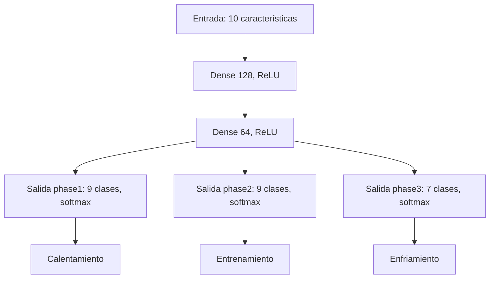
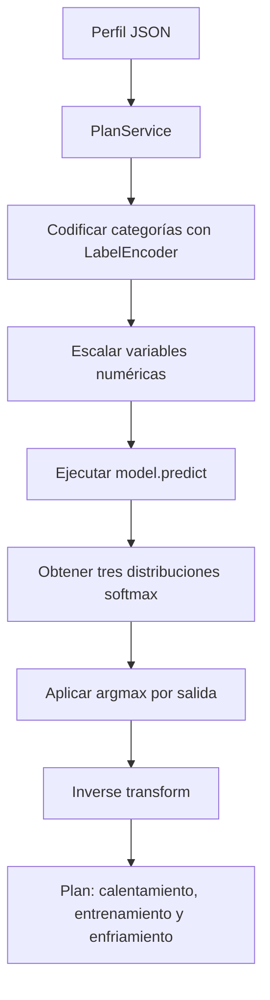

# Modelo de IA

## 1. Resumen

El sistema usa una **red neuronal multiclase y multietiqueta** que, dado el perfil de una persona, predice **3 ejercicios** (uno por fase del plan):

| Salida | Significado | Clases |
|--------|-------------|--------|
| `phase1` | Ejercicio de **calentamiento** | 9 |
| `phase2` | Ejercicio de **entrenamiento** | 9 |
| `phase3` | Ejercicio de **enfriamiento** | 7 |

Cada salida es una distribución de probabilidad *softmax*; se toma el `argmax` y se traduce a un nombre de ejercicio en español.

## 2. Variables de entrada (10 características)

**Numéricas (3):**

| Feature | Tipo | Rango esperado |
|---------|------|----------------|
| `Edad` | int | 10 – 120 años |
| `IMC` | float | 10 – 70 |
| `Tiempo de Actividad Física` | float | 0 – 500 min/semana |

**Categóricas (7):**

| Feature | Valores válidos |
|---------|-----------------|
| `Género` | Femenino, Masculino |
| `Nivel de Visión` | Miopía, Astigmatismo, Retinopatía, Ceguera Total, Hipermetropía, Baja Visión, Glaucoma |
| `Condición Física` | Moderada, Baja, Alta |
| `Condición Comórbida` | Diabetes Tipo 2, Ninguna, Artritis, Obesidad Severa |
| `Preferencia de Accesibilidad` | Guías auditivas, Guías táctiles, Supervisión humana |
| `Entorno de Ejercicio` | Hogar, Gimnasio, Exterior |
| `Motivación` | Moderada, Alta, Baja |

> **Fallback:** si llega un valor categórico **desconocido**, se sustituye por el valor más frecuente del dataset (ver tabla de defaults en §5).

## 3. Preprocesamiento

Realizado por `app/models/preprocessing.py`:

### 3.1 Imputación
- **Numéricas:** se convierten a numérico y los `NaN` se rellenan con la **media** de la columna.
- **Categóricas:** los `NaN` se rellenan con la cadena `'No aplica'`.

### 3.2 Codificación
- **Categóricas:** `LabelEncoder` (sklearn) -> entero por clase. Se guarda un encoder por columna.
- **Targets:** antes de codificar, se toma el **primer ejercicio** de la cadena (separador `';'`) y se le aplica `LabelEncoder`. Si el dato trae varios ejercicios (`"Marcha; Elevación"`), solo se usa el primero para entrenar.

### 3.3 Escalado
- Las columnas numéricas se escalan con `StandardScaler` (media 0, desviación 1).

### 3.4 Salida
- Los targets se convierten a **one-hot** (`to_categorical`) con `num_classes` por fase.

## 4. Arquitectura de la red

Definida en `app/models/neural.py`:

- **Optimizador:** Adam
- **Loss:** categorical_crossentropy por salida
- **Métricas:** accuracy por salida
- **Entrenamiento:** 50 épocas, batch 32, split estratificado 80/20 (por combinación fase1+fase2, reincorporando clases singulares al train).

## 5. Artefactos

### `artifacts/modelo5.keras`
La red entrenada, guardada con `model.save()` (formato Keras 3).

### `artifacts/preprocessors.pkl`
Contiene todo lo necesario para **servir** sin depender del Excel:

| Campo | Contenido |
|-------|-----------|
| `df_encoded` | Dataset completo preprocesado y codificado (512 filas) |
| `feature_columns` | Orden de las 10 features |
| `target_columns` | Las 3 columnas objetivo |
| `categorical_columns` | Las 7 columnas categóricas |
| `le_dict` | LabelEncoders por columna categórica |
| `target_encoders` | LabelEncoders por fase |
| `scaler` | StandardScaler ajustado |
| `num_classes` | Clases por fase (9/9/7) |
| `categorical_defaults` | Valor más frecuente por columna categórica |

**Defaults categóricos (fallback ante etiquetas desconocidas):**

| Columna | Default |
|---------|---------|
| Género | Femenino |
| Nivel de Visión | Miopía |
| Condición Física | Moderada |
| Condición Comórbida | Diabetes Tipo 2 |
| Preferencia de Accesibilidad | Guías auditivas |
| Entorno de Ejercicio | Hogar |
| Motivación | Moderada |

## 6. Flujo de inferencia

## 7. Reentrenamiento por feedback

Ver [`docs/04-flujo-de-feedback.md`](04-flujo-de-feedback.md). El modelo puede **aprender de nuevos ejemplos**: cuando el usuario corrige los ejercicios sugeridos, el backend:
1. Preprocesa el nuevo ejemplo (misma pipeline).
2. **Expande los encoders** si el ejercicio correcto es nuevo (aumenta `num_classes`).
3. Reentrena la red 10 épocas con el dataset completo + el nuevo ejemplo.
4. Guarda `modelo5.keras` y `preprocessors.pkl` actualizados.

> **Advertencia:** El reentrenamiento **modifica los artefactos de producción** (por diseño). En los tests se usa una copia temporal para no contaminarlos.
