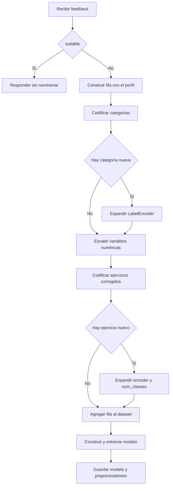

# Flujo de feedback y reentrenamiento

## 1. Idea general

Cuando el usuario considera que el plan sugerido **no es el adecuado**, el sistema permite corregir los ejercicios. Esa corrección se usa como **nuevo ejemplo de entrenamiento** para que el modelo aprenda de la preferencia del usuario.

## 2. Contrato de entrada

El endpoint `POST /api/feedback` recibe:

```json
{
  "suitable": false,
  "input_data": { "...perfil del usuario..." },
  "corrected_exercises": {
    "Calentamiento": "Rotaciones articulares suaves",
    "Entrenamiento": "Caminata en el lugar",
    "Enfriamiento": "Respiraciones profundas"
  }
}
```

- Si `suitable: true` -> el plan es adecuado -> **no se reentrena**. Respuesta inmediata:
  ```json
  { "status": "ok", "retrained": false, "message": "Plan adecuado, no se requiere reentrenamiento" }
  ```
- Si `suitable: false` -> se **reentrena** con las correcciones.

## 3. Algoritmo de reentrenamiento (`PlanService.apply_feedback`)



## 4. Efectos visibles

| Efecto | Detalle |
|--------|---------|
| **Expansión de clases** | Si el ejercicio corregido es nuevo, `num_classes` de esa fase crece (p. ej. Fase 2 de 9 -> 10) |
| **Catálogo actualizado** | El ejercicio nuevo aparece en `GET /api/exercises` |
| **Modelo persistido** | Se guarda `modelo5.keras` reentrenado |
| **Preprocesadores persistidos** | Se guarda `preprocessors.pkl` con los encoders expandidos |

## 5. Consideraciones

- **No idempotente:** cada feedback `false` modifica el estado de los artefactos.
- **Coste:** el reentrenamiento ejecuta 10 épocas sobre el dataset completo (CPU). Un `POST /api/feedback` tarda unos segundos.
- **Prevención en tests:** la suite de pruebas inyecta un `PlanService` con **artefactos temporales** (`tmp_path`) mediante `app.dependency_overrides`, para que el reentrenamiento **jamás contamine** los artefactos de producción. Ver `tests/conftest.py`.

## 6. Muestra de respuesta tras reentrenar

```json
{
  "status": "ok",
  "retrained": true,
  "message": "Modelo reentrenado y guardado"
}
```

Y `GET /api/health` refleja la expansión:

```json
{
  "num_classes": {
    "Ejercicios Fase 1 de Calentamiento": 9,
    "Ejercicios Fase 2 de Entrenamiento": 10,
    "Ejercicios Fase 3 de Enfriamiento": 7
  }
}
```
